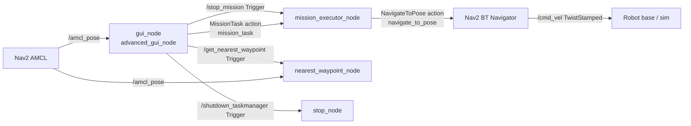
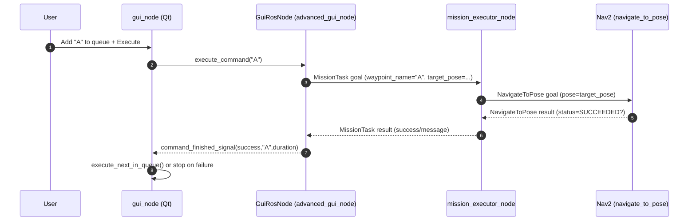

# taskmanager_pqt — Deep Study Guide

This document is a code-driven study guide for the ROS 2 package `taskmanager_pqt` (in this workspace: `taskmanager_pqt/`). It explains how the package is structured, what runs at runtime, and how messages/services/actions flow between components.

> Scope note: `taskmanager_pqt` is a *thin mission layer* around Nav2 and the Dynominion simulation. Many runtime nodes (Gazebo, Nav2 servers, AMCL, etc.) are launched from other packages and are treated here as external dependencies.

---

## 1) High‑Level System Architecture

### 1.1 Nodes in this package

Installed executables (see `taskmanager_pqt/CMakeLists.txt`):

- `gui_node` → `taskmanager_pqt/gui_node.py`
  - A PyQt GUI + embedded ROS node (`advanced_gui_node`) that:
    - starts simulation and helper nodes via `subprocess.Popen(...)`
    - queues “commands” (waypoints/maneuvers)
    - sends `MissionTask` action goals to the executor
    - provides manual joystick `/cmd_vel` publishing
- `mission_executor_node` → `taskmanager_pqt/mission_executor_node.py`
  - Action server for `MissionTask` (`mission_task`) that:
    - translates waypoint goals into Nav2 `NavigateToPose` action goals
    - executes simple “maneuvers” by publishing to `/cmd_vel`
    - provides `/stop_mission` to cancel/stop a running mission
- `nearest_waypoint_node` → `taskmanager_pqt/nearest_waypoint_node.py`
  - Subscribes to `/amcl_pose`, offers `/get_nearest_waypoint` service returning closest waypoint label
- `stop_node` → `taskmanager_pqt/stop_node.py`
  - Offers `/shutdown_taskmanager` service that calls `pkill -f ...` on a hardcoded list of processes
- `menu_node` → `taskmanager_pqt/menu_node.py`
  - CLI action client for `mission_task` (interactive terminal menu)
  - Starts simulation via `ros2 launch ...` if requested
- `control_node` → `taskmanager_pqt/control_node.py`
  - CLI tool that *directly* sends Nav2 `navigate_to_pose` goals (file header says “not in use for now”)

### 1.2 External nodes this package depends on at runtime

`taskmanager_pqt/launch/mission_launch.py` includes launch files from:

- `dynominion_gazebo` (Gazebo simulation, robot spawn, state publishers)
- `dynominion_navigation` (Nav2 bringup stack; includes `amcl`, BT navigator, planner/controller servers, lifecycle manager, etc.)

The key external interface for this package is Nav2’s action server:

- `navigate_to_pose` (`nav2_msgs/action/NavigateToPose`)

### 1.3 ROS interfaces (topics / services / actions)

#### Actions

- `mission_task` (`taskmanager_pqt/action/MissionTask`)
  - Server: `mission_executor_node`
  - Clients: `gui_node` (`GuiRosNode`), `menu_node`
- `navigate_to_pose` (`nav2_msgs/action/NavigateToPose`)
  - Client: `mission_executor_node` (and `control_node`)
  - Server: Nav2 BT Navigator

`MissionTask.action` (see `taskmanager_pqt/action/MissionTask.action`):

- Goal:
  - `string waypoint_name`
  - `geometry_msgs/PoseStamped target_pose`
- Result:
  - `bool success`
  - `string message`
- Feedback:
  - `string current_status` *(declared but not published by the current executor implementation)*

#### Services

- `/get_nearest_waypoint` (`std_srvs/srv/Trigger`)
  - Server: `nearest_waypoint_node`
  - Client: `gui_node` (`nearest_srv_client`)
- `/stop_mission` (`std_srvs/srv/Trigger`)
  - Server: `mission_executor_node`
  - Client: `gui_node` (`stop_client`)
- `/shutdown_taskmanager` (`std_srvs/srv/Trigger`)
  - Server: `stop_node`
  - Client: `gui_node` (`shutdown_srv_client`)

#### Topics

- `/amcl_pose` (`geometry_msgs/msg/PoseWithCovarianceStamped`)
  - Publisher: AMCL (Nav2)
  - Subscribers:
    - `nearest_waypoint_node` (stores latest pose for distance calculation)
    - `gui_node` (updates UI position + heading)
- `/cmd_vel` (`geometry_msgs/msg/TwistStamped`)
  - Publishers:
    - `gui_node` (manual joystick)
    - `mission_executor_node` (maneuvers + stop = zero velocity)
    - `control_node` (maneuvers + stop; not the main path)
  - Subscriber(s): Nav2 controller / robot base interface (external)
- `/cmd_vel_external` (`geometry_msgs/msg/Twist`)
  - Subscriber (temporary): `mission_executor_node` during `MANEUVER_LISTEN` (relays to `/cmd_vel`)
  - Intended publisher: external teleop / test publisher

### 1.4 Component relationships (who talks to whom)

Text diagram (most important links):

```
      +---------------------------+
      |        gui_node           |
      |  (PyQt + ROS node)        |
      |  node name: advanced_gui  |
      +------------+--------------+
                   |
                   | Action client: MissionTask
                   |   goal.waypoint_name + goal.target_pose
                   v
      +---------------------------+
      |   mission_executor_node   |
      |   Action server: mission  |
      +------------+--------------+
                   |
                   | Action client: Nav2 NavigateToPose
                   v
      +---------------------------+
      |        Nav2 stack         |
      |  (BT navigator, etc.)     |
      +------------+--------------+
                   |
                   | /cmd_vel (TwistStamped)
                   v
             Robot / Simulation

      /amcl_pose  ----------------->  gui_node + nearest_waypoint_node
      /get_nearest_waypoint  <------  gui_node -> nearest_waypoint_node
      /stop_mission          <------  gui_node -> mission_executor_node
      /shutdown_taskmanager  <------  gui_node -> stop_node
```

Mermaid (optional, if your Markdown viewer supports it):



---

## 2) Runtime Execution Flow

This section describes “normal GUI operation”: start sim → start executor → run a queued mission to completion → shutdown.

### 2.1 Launch process (simulation + Nav2)

When you click **Start Simulation** in the GUI:

1. `MainWindow.btn_start_sim.clicked` calls `GuiRosNode.launch_simulation()`.
2. `GuiRosNode.launch_simulation()` spawns:
   - `ros2 launch taskmanager_pqt mission_launch.py use_sim_time:=true`
   - stdout/stderr redirected to `simulation_gui.log`.
3. `mission_launch.py`:
   - includes `dynominion_gazebo` launch immediately
   - includes `dynominion_navigation` launch after a **15 s TimerAction**

Important implication: the Nav2 action server `navigate_to_pose` may only become available after Nav2 finishes bringup (after that delay + Nav2 startup).

### 2.2 Node initialization and spinning

When you run `ros2 run taskmanager_pqt gui_node`:

1. `gui_node.main()` calls `rclpy.init(...)`.
2. Creates `GuiRosNode()`:
   - sets up action client `mission_task`
   - creates service clients for `/stop_mission`, `/shutdown_taskmanager`, `/get_nearest_waypoint`
   - creates publisher `/cmd_vel` (`TwistStamped`)
   - subscribes to `/amcl_pose` (TRANSIENT_LOCAL durability) for immediate latest pose delivery
3. Starts a background ROS thread:
   - `threading.Thread(target=rclpy.spin, args=(ros_node,), daemon=True).start()`
4. Starts Qt UI event loop on the main thread via `app.exec_()`.

Key design: ROS callbacks run on the **ROS spin thread**, while UI updates happen on the **Qt main thread** via Qt signals (`pyqtSignal`).

### 2.3 Mission execution timeline (GUI queue)

A typical “go to waypoint A then stop” run looks like this:

1. User clicks waypoint button (e.g., **Target A**):
   - `MainWindow.add_to_queue("A")` appends to the queue list widget.
2. User clicks **Execute** (button wiring is built earlier in the file):
   - `MainWindow.start_execution()` sets `is_executing=True` and calls `execute_next_in_queue()`.
3. `MainWindow.execute_next_in_queue()`:
   - pops first queue item
   - calls `GuiRosNode.execute_command(cmd_name)`.
4. `GuiRosNode.execute_command("A")`:
   - builds `MissionTask.Goal` with:
     - `goal.waypoint_name = "A"`
     - `goal.target_pose = PoseStamped(map, x,y, w=1.0)`
   - `send_goal_async(...)` → registers `_goal_response_callback`.
5. On ROS spin thread: `_goal_response_callback` fires when the goal response arrives:
   - if accepted: registers `_get_result_callback`.
6. On ROS spin thread: `_get_result_callback` fires when the result arrives:
   - emits `command_finished_signal(success, cmd_name, duration)`.
7. On Qt main thread: `MainWindow.on_command_finished(...)`:
   - on success, schedules the next command with `QTimer.singleShot(400, execute_next_in_queue)`
   - on failure, unlocks joystick and stops the sequence
8. When the queue becomes empty:
   - `MainWindow.execute_next_in_queue()` ends the mission and unlocks the joystick.

### 2.4 Mission completion and shutdown behavior

- When the GUI window closes (`MainWindow.closeEvent`):
  - `GuiRosNode.shutdown_system()` writes `mission_report.csv`, terminates spawned subprocesses (sim/executor/nearest), and calls `/shutdown_taskmanager` if available.
- `stop_node`’s `/shutdown_taskmanager` is **not auto-started** by the GUI; you must run it yourself if you want that service.

---

## 3) Node‑Level Breakdown

### 3.1 `gui_node` (`taskmanager_pqt/gui_node.py`)

**ROS node name:** `advanced_gui_node` (`GuiRosNode`)

**Responsibility**

- Human-facing mission control (queueing + progress log)
- Starts other components with `subprocess.Popen(...)`
- Bridges ROS callbacks into Qt signals
- Provides a manual “joystick” by publishing `TwistStamped` to `/cmd_vel`

**Publishers**

- `/cmd_vel` (`TwistStamped`) — manual joystick commands (`publish_joystick_cmd`)

**Subscribers**

- `/amcl_pose` (`PoseWithCovarianceStamped`) — updates UI position and heading (`_amcl_cb`)

**Service clients**

- `/get_nearest_waypoint` (`Trigger`) — request closest waypoint (`trigger_nearest_waypoint`)
- `/stop_mission` (`Trigger`) — emergency stop / cancel (`trigger_stop`)
- `/shutdown_taskmanager` (`Trigger`) — global kill request at exit (`shutdown_system`)

**Action clients**

- `mission_task` (`MissionTask`) — send waypoint / maneuver commands (`execute_command`)

**Non-ROS runtime components**

- `MainWindow` manages:
  - queue list (`add_to_queue`, `execute_next_in_queue`)
  - execution locking (disables joystick while mission runs)
  - status polling every 1 s (`_update_status`) using `count_publishers('/amcl_pose')` and `count_subscribers('/goal_pose')` as heuristics

### 3.2 `mission_executor_node` (`taskmanager_pqt/mission_executor_node.py`)

**ROS node name:** `mission_executor_node`

**Responsibility**

- Provides the `MissionTask` action server (`mission_task`)
- Converts waypoint goals into Nav2 `NavigateToPose` goals
- Provides “maneuver” commands implemented by publishing `/cmd_vel`
- Provides stop/cancel capability via `/stop_mission`

**Publishers**

- `/cmd_vel` (`TwistStamped`) — used for:
  - rotation maneuver (`rotate`)
  - stop = publish zero (`stop_mission_callback`)
  - relaying `/cmd_vel_external` during listen maneuver (`_cmd_vel_relay_cb`)

**Subscribers**

- Temporary subscription to `/cmd_vel_external` (`Twist`) only during `MANEUVER_LISTEN`

**Service servers**

- `/stop_mission` (`Trigger`) — sets `_stop_requested=True`, publishes zero, cancels Nav2 goal if active

**Action server**

- `mission_task` (`MissionTask`)
  - `goal_callback`: accepts every goal
  - `execute_callback`:
    - if `waypoint_name` starts with `MANEUVER_ROT_<deg>_<CW|CCW>` → rotation by publishing `/cmd_vel`
    - else if `waypoint_name == MANEUVER_LISTEN` → subscribes `/cmd_vel_external`, relays for ~5 s
    - else → treat as navigation:
      - sends `NavigateToPose` goal to Nav2
      - waits for Nav2 result and returns `MissionTask.Result`

**Action client**

- `navigate_to_pose` (`NavigateToPose`) — sends goals to Nav2

### 3.3 `nearest_waypoint_node` (`taskmanager_pqt/nearest_waypoint_node.py`)

**ROS node name:** `nearest_waypoint_node`

**Responsibility**

- Keeps the latest AMCL pose in memory
- Computes Euclidean distance to each predefined waypoint
- Returns the nearest waypoint label via service

**Subscribers**

- `/amcl_pose` (`PoseWithCovarianceStamped`) — stores `self.amcl_pose`
  - QoS: depth=10, durability=TRANSIENT_LOCAL

**Service servers**

- `/get_nearest_waypoint` (`Trigger`) — response.message is the waypoint label (`"A"`, `"B"`, ...)

### 3.4 `stop_node` (`taskmanager_pqt/stop_node.py`)

**ROS node name:** `stop_node`

**Responsibility**

- Provides a “big red switch” service
- Kills processes by name match using `pkill -f`

**Service servers**

- `/shutdown_taskmanager` (`Trigger`)
  - Iterates through a hardcoded list including Nav2 + Gazebo process names and calls `pkill -f <pattern>`.

### 3.5 `menu_node` (`taskmanager_pqt/menu_node.py`)

**ROS node name:** `menu_node`

**Responsibility**

- Terminal menu wrapper that sends one `MissionTask` goal per waypoint selection

**Action client**

- `mission_task` (`MissionTask`) — uses `rclpy.spin_until_future_complete(...)` to block until goal and result complete

**Important mismatch**

- `menu_node` sends maneuver commands `MANEUVER_HALF_SPIN` / `MANEUVER_FULL_SPIN`, but `mission_executor_node` currently only implements:
  - `MANEUVER_ROT_<deg>_<dir>`
  - `MANEUVER_LISTEN`

So the “half/full spin” options in `menu_node` will not be executed as maneuvers by the current executor.

### 3.6 `control_node` (`taskmanager_pqt/control_node.py`)

**ROS node name:** `control_node`

**Responsibility**

- Older/alternative CLI that talks directly to Nav2 (`navigate_to_pose`)
- Uses a background `SingleThreadedExecutor` thread while `input()` runs in the main thread

**Note**

- File header says it is “not in use for now”; the GUI + `MissionTask` path is the main architecture.

---

## 4) Callback Execution Flow

This section lists *callbacks that actually drive runtime behavior* and explains when they fire.

### 4.1 GUI side (`GuiRosNode` + `MainWindow`)

**ROS callbacks (ROS spin thread)**

- `GuiRosNode._amcl_cb(msg)`
  - Trigger: a new `/amcl_pose` message arrives
  - Effect: converts quaternion→yaw and emits `amcl_pose_signal(x,y,yaw_deg)`
- `GuiRosNode.nearest_response_callback(future)`
  - Trigger: `/get_nearest_waypoint` async service call completes
  - Effect: emits `nearest_wp_signal(success, message)`
- `GuiRosNode._goal_response_callback(future)`
  - Trigger: `mission_task` goal response arrives
  - Effect: if accepted, attaches `_get_result_callback` to the result future
- `GuiRosNode._get_result_callback(future)`
  - Trigger: `mission_task` result arrives
  - Effect: logs mission outcome and emits `command_finished_signal(...)`

**Qt callbacks (Qt main thread)**

- `MainWindow._update_status()` (1 Hz timer)
  - Trigger: periodic timer tick
  - Effect: updates status bar and LEDs using ROS graph queries (publisher/subscriber counts)
- `MainWindow.on_nearest_wp_received(success, waypoint_name)`
  - Trigger: `nearest_wp_signal`
  - Effect: if idle, replaces queue and starts mission; if running, appends to queue
- `MainWindow.execute_next_in_queue()`
  - Trigger: start of mission and after each command success
  - Effect: sends the next command via `GuiRosNode.execute_command(...)`
- `MainWindow.on_command_finished(success, cmd_name, duration)`
  - Trigger: `command_finished_signal`
  - Effect: schedules next command on success; aborts sequence on failure
- `MainWindow.closeEvent(...)`
  - Trigger: window closing
  - Effect: calls `GuiRosNode.shutdown_system()`

### 4.2 Executor side (`MissionExecutorNode`)

- `MissionExecutorNode.stop_mission_callback(request, response)` (service)
  - Trigger: `/stop_mission` called
  - Effect:
    - sets `_stop_requested=True`
    - publishes zero `/cmd_vel`
    - cancels the current Nav2 goal if one exists
- `MissionExecutorNode.goal_callback(goal_request)` (action server)
  - Trigger: a new `mission_task` goal arrives
  - Effect: always `ACCEPT`
- `MissionExecutorNode.execute_callback(goal_handle)` (action server)
  - Trigger: after goal acceptance
  - Effect:
    - executes maneuver or navigation, then sets goal state (succeed/abort/canceled)
- `MissionExecutorNode._cmd_vel_relay_cb(msg)` (topic)
  - Trigger: a `/cmd_vel_external` message arrives while listening
  - Effect: republish as `TwistStamped` on `/cmd_vel`

### 4.3 Nearest waypoint node (`NearestWaypointServiceNode`)

- `NearestWaypointServiceNode._pose_cb(msg)`
  - Trigger: `/amcl_pose` message arrives
  - Effect: store `self.amcl_pose`
- `NearestWaypointServiceNode.get_nearest_callback(request, response)`
  - Trigger: `/get_nearest_waypoint` called
  - Effect: compute nearest waypoint and return it in `response.message`

---

## 5) Executor and Threading Model

### 5.1 GUI (`gui_node`)

- **Qt main thread:** all widgets, button handlers, queue logic.
- **ROS spin thread:** `rclpy.spin(ros_node)` runs callbacks.
- **Cross-thread safety:** UI updates are performed via Qt signals (`pyqtSignal`) emitted by the ROS node.

Potential pitfall: any direct UI manipulation from ROS callbacks would be unsafe; this package correctly avoids that by emitting signals.

### 5.2 Mission executor (`mission_executor_node`)

- Uses `MultiThreadedExecutor()` in `main()` and passes it to `rclpy.spin(node, executor=executor)`.
- No explicit callback groups are configured; services and action server use default behavior.

Practical takeaway:

- Long-running loops (`rotate`, `listen_cmd_vel`) contain `time.sleep(...)` and can block a worker thread.
- The stop service is intended to interrupt missions by setting `_stop_requested` and canceling the Nav2 goal.

If you observe that `/stop_mission` is delayed during long action execution, the typical ROS 2 fix is to place the stop service and/or action server in a `ReentrantCallbackGroup` or separate callback groups (not currently done in code).

### 5.3 CLI nodes (`menu_node`, `control_node`)

- `menu_node` does not spin continuously; it blocks on futures using `rclpy.spin_until_future_complete`.
- `control_node` creates a `SingleThreadedExecutor`, spins it in a background thread, and runs the `input()` loop on the main thread.

---

## 6) Action Communication Flow (MissionTask ↔ NavigateToPose)

### 6.1 MissionTask (GUI/menu → executor)

Lifecycle (as implemented):

1. **Client creates goal**
   - waypoint: `goal.waypoint_name = "A"` and `goal.target_pose` set
   - maneuver: `goal.waypoint_name = "MANEUVER_ROT_180_CW"` (no pose required)
2. **Send goal**
   - `send_goal_async(goal)` from GUI/menu client
3. **Server goal_callback**
   - executor accepts all goals (`GoalResponse.ACCEPT`)
4. **Server execute_callback**
   - runs navigation or maneuver
5. **Result**
   - executor returns `MissionTask.Result(success=..., message=...)`
6. **Client result handling**
   - GUI updates logs and advances queue

Feedback: `MissionTask.action` defines feedback, but the executor does not call `goal_handle.publish_feedback(...)`, and the GUI does not register a feedback callback. Treat feedback as “reserved for future use”.

### 6.2 NavigateToPose (executor → Nav2)

Lifecycle (as implemented in `MissionExecutorNode.execute_callback`):

1. Check Nav2 server availability:
   - `self.nav_client.wait_for_server(timeout_sec=5.0)`
2. Build Nav2 goal:
   - `nav_goal.pose = req.target_pose`
3. Send goal:
   - `await self.nav_client.send_goal_async(nav_goal)`
4. Wait for result:
   - `await nav_goal_handle.get_result_async()`
5. Map status to `MissionTask` result:
   - `SUCCEEDED (4)` → `MissionTask` succeed
   - `CANCELED (5)` or stop requested → `MissionTask` canceled
   - otherwise → `MissionTask` abort

Stop interaction:

- `/stop_mission` cancels the Nav2 goal via `self._nav_goal_handle.cancel_goal_async()` and sets `_stop_requested=True`.

---

## 7) Topic Data Flow (origin → transformation → usage)

### 7.1 `/amcl_pose`

- **Origin:** Nav2 AMCL (external)
- **Consumers:**
  - `nearest_waypoint_node` stores pose and computes nearest waypoint when asked
  - `gui_node` converts orientation quaternion → yaw (degrees) and updates the UI (xy + compass)
- **Transformation:** quaternion → yaw and Euclidean distance computations

### 7.2 `/cmd_vel` (manual and maneuver motion)

- **Origins:**
  - GUI joystick (`GuiRosNode.publish_joystick_cmd`) publishes `TwistStamped` scaled:
    - `linear.x = linear * 0.4`, `angular.z = angular * 0.7`
  - Mission executor publishes `TwistStamped`:
    - rotation maneuver (`rotate`)
    - stop = zero velocity (both stop service and maneuver completion)
- **Consumers:** Nav2/controller/robot base (external)

### 7.3 `/cmd_vel_external` (relay input during “listen” maneuver)

- **Origin:** any external publisher (teleop/testing)
- **Transformation:** `Twist` → `TwistStamped` with updated header (`_make_twist_stamped`)
- **Destination:** `/cmd_vel`

---

## 8) Code Walkthrough (major files)

### `taskmanager_pqt/launch/mission_launch.py`

- Includes simulation launch and delays navigation bringup by 15 seconds.
- Exposes `use_sim_time` launch argument.

### `taskmanager_pqt/gui_node.py`

- `GuiRosNode` is the ROS layer: publishers/subscribers/action+service clients + subprocess launchers.
- `MainWindow` is the mission engine:
  - maintains a command queue
  - locks joystick during execution
  - calls `GuiRosNode.execute_command` for each item
  - advances mission based on `command_finished_signal`

### `taskmanager_pqt/mission_executor_node.py`

- `MissionExecutorNode` is the bridge between high-level mission goals and Nav2 navigation.
- Implements stop semantics and local maneuvers with velocity commands.

### `taskmanager_pqt/nearest_waypoint_node.py`

- Simple “query” server: caches `/amcl_pose` and returns nearest waypoint label on demand.

### `taskmanager_pqt/stop_node.py`

- Coarse shutdown mechanism; useful during development, but can be dangerous on shared systems due to `pkill -f` matching.

---

## 9) Debugging Guide

### 9.1 Start with the ROS graph

1. List nodes:
   - `ros2 node list`
2. Confirm interfaces:
   - `ros2 action list`
   - `ros2 service list | rg \"stop_mission|get_nearest_waypoint|shutdown_taskmanager\"`
   - `ros2 topic list | rg \"amcl_pose|cmd_vel\"`
3. Inspect details:
   - `ros2 action info /mission_task`
   - `ros2 action info /navigate_to_pose`
   - `ros2 service type /stop_mission`
   - `ros2 topic info -v /cmd_vel`

### 9.2 Common failure modes and how to trace them

**A) GUI says “Action server offline. Is Executor running?”**

- Verify executor is running:
  - `ros2 node list | rg mission_executor_node`
- Verify action server exists:
  - `ros2 action list | rg mission_task`
- Check executor logs:
  - `tail -n 200 executor_gui.log`

**B) Executor says “Nav2 action server not available!”**

- Verify Nav2 is up:
  - `ros2 action list | rg navigate_to_pose`
- Check simulation bringup log:
  - `tail -n 200 simulation_gui.log`
- Remember: `mission_launch.py` delays nav bringup by **15 s**; plus Nav2 startup time.

**C) Nearest waypoint fails (“No pose available”)**

- Ensure AMCL publishes:
  - `ros2 topic echo /amcl_pose --once`
- Confirm the GUI or nearest node sees publishers:
  - `ros2 topic info /amcl_pose`

**D) Stop doesn’t stop quickly**

- Call stop service manually and watch executor logs:
  - `ros2 service call /stop_mission std_srvs/srv/Trigger {}`
- If delay persists, consider callback-group refactoring (see threading section).

### 9.3 Probing the system with CLI commands

**Send a MissionTask goal (waypoint A)**

```bash
ros2 action send_goal /mission_task taskmanager_pqt/action/MissionTask \
"{waypoint_name: 'A', target_pose: {header: {frame_id: 'map'}, pose: {position: {x: -2.53, y: -2.2, z: 0.0}, orientation: {w: 1.0}}}}"
```

**Send a rotation maneuver**

```bash
ros2 action send_goal /mission_task taskmanager_pqt/action/MissionTask \
"{waypoint_name: 'MANEUVER_ROT_180_CW'}"
```

**Call nearest waypoint**

```bash
ros2 service call /get_nearest_waypoint std_srvs/srv/Trigger {}
```

**Emergency stop**

```bash
ros2 service call /stop_mission std_srvs/srv/Trigger {}
```

**Test the “listen” relay (if you add a GUI/CLI entry for it)**

In one terminal:

```bash
ros2 action send_goal /mission_task taskmanager_pqt/action/MissionTask \
"{waypoint_name: 'MANEUVER_LISTEN'}"
```

In another terminal, publish external cmd vel:

```bash
ros2 topic pub /cmd_vel_external geometry_msgs/msg/Twist \
"{linear: {x: 0.1}, angular: {z: 0.2}}" -r 10
```

---

## 10) Sequence Diagrams

### 10.1 Waypoint mission (GUI → executor → Nav2)



### 10.2 Emergency stop during navigation

```mermaid
sequenceDiagram
  autonumber
  participant User
  participant ROS as GuiRosNode
  participant EXEC as mission_executor_node
  participant NAV2 as Nav2 (navigate_to_pose)

  User->>ROS: trigger_stop()
  ROS->>EXEC: /stop_mission Trigger
  EXEC->>EXEC: _stop_requested=true; publish /cmd_vel=0
  EXEC->>NAV2: cancel_goal_async()
  NAV2-->>EXEC: result status=CANCELED
  EXEC-->>ROS: MissionTask result (success=false, message="stopped")
```

---

## Appendix: Build/installation notes (why the package looks like this)

- The package uses `ament_cmake` because it generates a custom action interface:
  - `rosidl_generate_interfaces(... "action/MissionTask.action" ...)` in `taskmanager_pqt/CMakeLists.txt`.
- After building, remember to source:
  - `source install/setup.bash`
- Background context and historical errors are documented in `taskmanager_pqt/TROUBLESHOOTING.md`.

